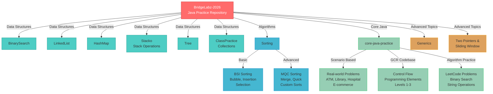

# 🚀 BridgeLabz Java Practice Workspace

> A comprehensive collection of Java programs and data structure implementations organized by topic, difficulty level, and use cases. Perfect for learning, practicing, and mastering Java development.

[](https://www.oracle.com/java/technologies/javase/jdk23-archive-downloads.html)
[](LICENSE)
[](README.md)

---

## 📋 Table of Contents

- [Features Overview](#features-overview)
- [Project Architecture](#project-architecture)
- [Quick Start](#quick-start)
- [Module Structure](#module-structure)
- [Learning Path](#learning-path)
- [Getting Started](#getting-started)
- [Notes](#notes)

---

## ✨ Features Overview



---

## 📂 Project Architecture

### **Data Structures** 🏗️
- **BinarySearch** - Binary search implementations with peak elements, matrix search, rotation point finder
- **BST** - Binary Search Tree practice covering search, insert, delete, validation, kth smallest, and LCA
- **Heap** - Heap practice covering heapify, heap sort, top-k, kth largest, and merge-k-sorted-lists
- **Graph** - Graph practice covering representation, BFS/DFS traversal, shortest path, connectivity, and cycle detection
- **LinkedList** - Linked list operations and node management
- **HashMap** - Hash map practice problems
- **Stacko** - Stack operations: balanced brackets, call stack, stock span, next greater element
- **Tree** - Tree traversal and tree-based problems
- **ClassPractice** - Collections framework practice (ArrayList, HashMap, HashSet, TreeMap, LinkedList, etc.)

### **Sorting Algorithms** 🔄
- **BSI Sorting** - Basic sorting with real-world scenarios
  - Bubble Sort: Product prices, student marks
  - Selection Sort: Exam scores, movie ratings
  - Insertion Sort: Employee IDs and attendance ranking
- **MQC Sorting** - Advanced sorting with complex scenarios
  - Merge Sort: Customer records, patient registration, employee salaries
  - Quick Sort: Flight ticket prices
  - Bank fraud detection, hospital emergency triage

### **Core Java Practice** 💻
- **Scenario-Based Programs** - Real-world applications
  - ATM Withdrawal System
  - Smart Library Management
  - Hospital Billing System
  - E-commerce Product Inventory
  - Customer Feedback Analysis
  - Online Quiz Platform
  - And 30+ more real-world scenarios
- **GCR Codebase** - Structured learning by levels
  - Level 1, 2, 3 Practice Problems
  - Control Flow exercises
  - Programming Elements fundamentals
- **LeetCode Practice** - Algorithm problem solving

### **Advanced Topics** 🚀
- **Generics** - Type-safe programming with Java generics
- **Two Pointers & Sliding Window** - Efficient algorithmic patterns
  - LeetCode practice problems
  - Scenario-based applications

---

## 🚀 Quick Start

### Prerequisites
- Java SE 23 or higher installed
- A terminal or IDE (VS Code, IntelliJ IDEA, Eclipse, etc.)

### Compilation & Execution

```bash
# Navigate to the desired directory
cd path/to/module

# Compile the Java file
javac YourFileName.java

# Run the program
java YourFileName
```

**Example:**
```bash
cd BinarySearch
javac BinarySearchScenario.java
java BinarySearchScenario
```

### Graph Practice Run Example
```bash
cd Graph
javac GraphPracticeQuestions.java
java GraphPracticeQuestions
```

---

## 📁 Module Structure

```
BridgeLabz-2026/
│
├── BinarySearch/               # Binary search algorithms
├── BST/                        # Binary Search Tree practice problems
├── Heap/                       # Heap practice problems
├── Graph/                      # Graph traversal and cycle-detection problems
├── LinkedList/                 # Linked list implementations
├── HashMap/                    # Hash map operations
├── Stacko/                     # Stack-based problems
├── Tree/                       # Tree traversals & operations
├── ClassPractice/              # Collections framework practice
│
├── BSI\ sorting/               # Basic sorting algorithms
├── MQC\ sorting/               # Advanced sorting with scenarios
│
├── core-java-practice/         # Core Java fundamentals
│   ├── Core-Java_Scenerio-Based/
│   ├── gcr-codebase/
│   └── leetcode-codebase/
│
├── Generics/                   # Generic programming
├── TwoPointersAndSlidingWindow/ # Advanced patterns
│
└── README.md                   # This file
```

---

## 🎓 Learning Path

### Beginner Level ✅
1. Start with **core-java-practice** → Programming Elements L1 & L2
2. Learn Collections in **ClassPractice**
3. Practice basic algorithms in **BinarySearch** and **BSI Sorting**

### Intermediate Level 🔄
4. Master **Data Structures**: LinkedList, HashMap, Stack, Tree
5. Learn advanced **Sorting Algorithms**: MQC Sorting
6. Solve **Scenario-Based Problems** in core-java-practice

### Advanced Level 🚀
7. Explore **Generics** for type-safe programming
8. Master **Two Pointers & Sliding Window** techniques
9. Solve **LeetCode Problems**

---

## 🎯 Getting Started

### Step 1: Clone or Download
```bash
git clone <repository-url>
cd BridgeLabz-2026
```

### Step 2: Choose Your Learning Path
Pick a module based on your skill level (see Learning Path above)

### Step 3: Navigate & Execute
```bash
cd ModuleName
javac FileName.java
java FileName
```

### Step 4: Review & Learn
- Study the code implementation
- Understand the logic and patterns
- Modify and experiment with the code

---

## 📝 Key Features

✅ **Comprehensive Collection** - 100+ Java programs across multiple topics  
✅ **Real-World Scenarios** - Practical applications of programming concepts  
✅ **Structured Progression** - Learn from basics to advanced topics  
✅ **Multiple Algorithm Implementations** - Various approaches to solving problems  
✅ **Data Structure Practice** - Master arrays, stacks, queues, trees, graphs  
✅ **Sorting & Searching** - Implement and understand different algorithms  
✅ **LeetCode Integration** - Solve popular coding interview problems  
✅ **Standalone Programs** - Each file is independent and can run individually  

---

## 📚 Learning Highlights

- **Java Syntax & File Structure** - Learn proper Java program organization
- **Input/Output Operations** - Master Scanner for console input/output
- **Data Types & Type Conversion** - Understand Java type system
- **Control Flow** - Conditionals and loops implementation
- **Collections Framework** - ArrayList, HashMap, LinkedList, TreeSet, etc.
- **Object-Oriented Programming** - Classes, inheritance, polymorphism
- **Recursion** - Recursive problem solving techniques
- **Algorithms** - Sorting, searching, and pattern matching
- **Data Structures** - Lists, stacks, queues, trees, hash tables
- **Problem-Solving** - Real-world scenario implementations

---

## 📋 Important Notes

- ✨ All Java files are **standalone** and compile independently
- 📝 User input uses `Scanner sc` for console interaction
- 🔧 No helper methods in generated practice files
- 🎯 Each program focuses on specific concepts
- 💡 Code can be modified and experimented with freely

---

## 🤝 Best Practices

1. **Read the code carefully** before running it
2. **Understand the logic** behind each implementation
3. **Test with different inputs** to verify correctness
4. **Modify and experiment** to deepen understanding
5. **Compare different approaches** for the same problem
6. **Practice consistently** to build muscle memory

---

## 📞 Support

For questions or issues:
- Review the code comments
- Check the learning highlights section
- Experiment with different inputs
- Compare with similar implementations in the repository

---

## 📄 License

This project is licensed under the MIT License - see the LICENSE file for details.

---

**Last Updated:** July 2026  
**Status:** 🟢 Active & Maintained  
**Java Version:** 23  

**Happy Coding! 🎉**


